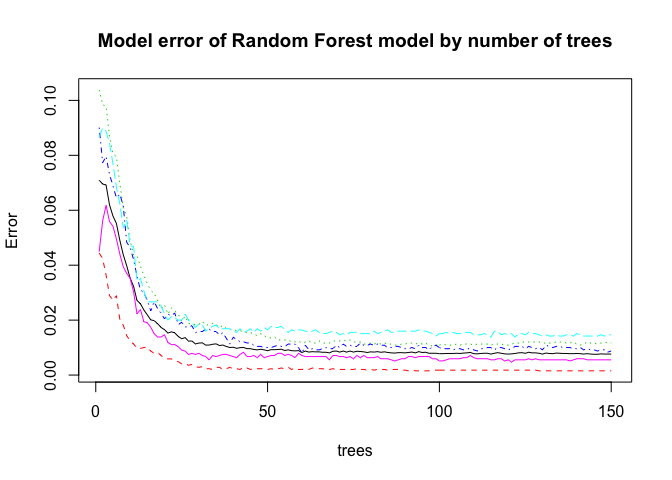
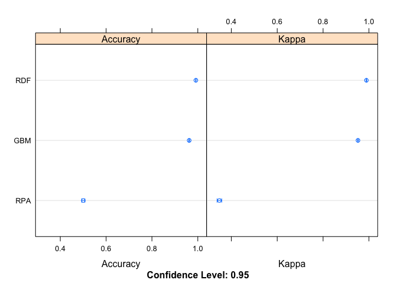

## Background

Using devices such as Jawbone Up, Nike FuelBand, and Fitbit it is now possible to collect a large amount of data about personal activity relatively inexpensively. These type of devices are part of the quantified self movement – a group of enthusiasts who take measurements about themselves regularly to improve their health, to find patterns in their behavior, or because they are tech geeks. One thing that people regularly do is quantify how much of a particular activity they do, but they rarely quantify how well they do it. In this project, your goal will be to use data from accelerometers on the belt, forearm, arm, and dumbell of 6 participants. They were asked to perform barbell lifts correctly and incorrectly in 5 different ways. More information is available from the website here: http://groupware.les.inf.puc-rio.br/har (see the section on the Weight Lifting Exercise Dataset). 

## Executive Summary

The goal of your project is to predict the manner in which they did the exercise. This is the "classe" variable in the training set. You may use any of the other variables to predict with. You should create a report describing how you built your model, how you used cross validation, what you think the expected out of sample error is, and why you made the choices you did. You will also use your prediction model to predict 20 different test cases. 

## Data Preparation

The training data for this project are available here:

https://d396qusza40orc.cloudfront.net/predmachlearn/pml-training.csv

The test data are available here:

https://d396qusza40orc.cloudfront.net/predmachlearn/pml-testing.csv

The data for this project come from this source: http://groupware.les.inf.puc-rio.br/har. If you use the document you create for this class for any purpose please cite them as they have been very generous in allowing their data to be used for this kind of assignment. 

# Loading libraries and data

```r
library(caret)
library(dplyr)
library(rpart)
library(rattle)
```

Load data and check the dimensions.

```r
train_org <- read.csv("https://d396qusza40orc.cloudfront.net/predmachlearn/pml-training.csv")
test_org <-  read.csv("https://d396qusza40orc.cloudfront.net/predmachlearn/pml-testing.csv")
dim(train_org)
```

```
## [1] 19622   160
```

```r
dim(test_org)
```

```
## [1]  20 160
```

The training set has **19622** observations and **160** variables and the testing set has **20** observations and **160** variables.

# Data Cleaning
Remove all near zero variance of all data. These variables have very unique values relative to the number of smaples.

```r
nzv <- nearZeroVar(train_org)
train_nzv <- train_org[,-nzv]
test_nzv <- test_org[,-nzv]
dim(train_nzv)
```

```
## [1] 19622   100
```

```r
dim(test_nzv)
```

```
## [1]  20 100
```

That changed the variables from **160** to **100**.

Remove NA variables with a threshold over the 90% from the dataset.

```r
nas <- sapply(train_nzv, function(x) mean(is.na(x))) > 0.90
TrainSet <- train_nzv[, nas==FALSE]
TestSet  <- test_nzv[, nas==FALSE]
dim(TrainSet)
```

```
## [1] 19622    59
```

```r
dim(TestSet)
```

```
## [1] 20 59
```

This results in a decrease of varaibles with **41**.

Remove the X, user_name, timestamps and windows variables, they do not contribute much to the measurements.

```r
remove_cols <- grepl("^X|user_name|timestamp|window", names(TrainSet))
TrainSet <- TrainSet[, !remove_cols]
TestSet  <- TestSet[, !remove_cols]
dim(TrainSet)
```

```
## [1] 19622    53
```

```r
dim(TestSet)
```

```
## [1] 20 53
```


Check if there are different variables between the train and test set.

```r
print(paste("Variables in Train and not in Test: ",setdiff(colnames(TrainSet), colnames(TestSet))))
```

```
## [1] "Variables in Train and not in Test:  classe"
```

```r
print(paste("Variables in Test and not in Train: ",setdiff(colnames(TestSet), colnames(TrainSet))))
```

```
## [1] "Variables in Test and not in Train:  problem_id"
```

Test set has no ``classe`` and thats correct we want to predict this one, but Test set has a extra variable ``problem_id``, remove it from the test. 


```r
TestSet <- subset(TestSet, select=-c(problem_id))
dim(TrainSet)
```

```
## [1] 19622    53
```

```r
dim(TestSet)
```

```
## [1] 20 52
```

Create training and validation partitions from TrainSet for modeling.

```r
set.seed(613)
inTrain  <- createDataPartition(TrainSet$classe, p=0.7, list=FALSE)
TrainSet <- TrainSet[inTrain, ]
ValSet   <- TrainSet[-inTrain, ]
dim(TrainSet)
```

```
## [1] 13737    53
```

```r
dim(ValSet)
```

```
## [1] 4122   53
```

## Prediction Model Building

Three methods will be applied to model the Train dataset and the best one (with higher accuracy when applied to the Test dataset) will be used for the quiz predictions. 

The methods are:

- Decision Tree (rpart) 
- Random Forest (rf)  
- Stochastic Gradient Boosting (also known as Gradient Boosted Machine or GBM). 

Each model is automatically tuned and is evaluated using 3 repeats of 10-fold cross validation. A Confusion Matrix is plotted at the end of each model to better visualize the accuracy of the models.

The random number seed is set before each algorithm is trained to ensure that each algorithm gets the same data partitions and repeats. This allows us to compare apples to apples in the final results. 

Setting the trainControl. 

```r
control <- trainControl(method="repeatedcv", number=10, repeats=3)
```

### Decision Tree (rpart)
Let start with a Decision Tree and visualize it.

```r
set.seed(613)
fit.rpart <- train(classe ~ .,data=TrainSet, method="rpart", trControl=control)
fancyRpartPlot(fit.rpart$finalModel)
```

<!-- -->

Prediction on the Validation dataset.

```r
pred.rpart <- predict(fit.rpart, newdata=ValSet)
cm.rpart <- confusionMatrix(pred.rpart, ValSet$classe)
cm.rpart 
```

```
## Confusion Matrix and Statistics
## 
##           Reference
## Prediction    A    B    C    D    E
##          A 1062  337  330  309  105
##          B   13  274   28  141   96
##          C   75  204  378  235  179
##          D    0    0    0    0    0
##          E    2    0    0    0  354
## 
## Overall Statistics
##                                           
##                Accuracy : 0.5017          
##                  95% CI : (0.4863, 0.5171)
##     No Information Rate : 0.2795          
##     P-Value [Acc > NIR] : < 2.2e-16       
##                                           
##                   Kappa : 0.3499          
##  Mcnemar's Test P-Value : NA              
## 
## Statistics by Class:
## 
##                      Class: A Class: B Class: C Class: D Class: E
## Sensitivity            0.9219  0.33620   0.5136   0.0000  0.48229
## Specificity            0.6360  0.91594   0.7953   1.0000  0.99941
## Pos Pred Value         0.4956  0.49638   0.3529      NaN  0.99438
## Neg Pred Value         0.9545  0.84846   0.8827   0.8338  0.89910
## Prevalence             0.2795  0.19772   0.1786   0.1662  0.17807
## Detection Rate         0.2576  0.06647   0.0917   0.0000  0.08588
## Detection Prevalence   0.5199  0.13392   0.2598   0.0000  0.08637
## Balanced Accuracy      0.7790  0.62607   0.6545   0.5000  0.74085
```

With Decision Tree, we reach an accuracy of **50.1698205**%. This is not so good, let’s see what we can do with Random Forest.

### Random Forest

```r
set.seed(613)
fit.rf <- train(classe ~ ., data=TrainSet, method="rf", trControl=control, ntree=150)
plot(fit.rf$finalModel, main="Model error of Random Forest model by number of trees")
```

<!-- -->

Prediction on Validation dataset.

```r
pred.rf <- predict(fit.rf, newdata=ValSet)
cm.rf <- confusionMatrix(pred.rf, ValSet$classe)
cm.rf
```

```
## Confusion Matrix and Statistics
## 
##           Reference
## Prediction    A    B    C    D    E
##          A 1152    0    0    0    0
##          B    0  815    0    0    0
##          C    0    0  736    0    0
##          D    0    0    0  685    0
##          E    0    0    0    0  734
## 
## Overall Statistics
##                                      
##                Accuracy : 1          
##                  95% CI : (0.9991, 1)
##     No Information Rate : 0.2795     
##     P-Value [Acc > NIR] : < 2.2e-16  
##                                      
##                   Kappa : 1          
##  Mcnemar's Test P-Value : NA         
## 
## Statistics by Class:
## 
##                      Class: A Class: B Class: C Class: D Class: E
## Sensitivity            1.0000   1.0000   1.0000   1.0000   1.0000
## Specificity            1.0000   1.0000   1.0000   1.0000   1.0000
## Pos Pred Value         1.0000   1.0000   1.0000   1.0000   1.0000
## Neg Pred Value         1.0000   1.0000   1.0000   1.0000   1.0000
## Prevalence             0.2795   0.1977   0.1786   0.1662   0.1781
## Detection Rate         0.2795   0.1977   0.1786   0.1662   0.1781
## Detection Prevalence   0.2795   0.1977   0.1786   0.1662   0.1781
## Balanced Accuracy      1.0000   1.0000   1.0000   1.0000   1.0000
```

With Random Forest, we reach an accuracy of **100**%. This is very good, let’s see what we can expect with Stochastic Gradient Boosting.

### Stochastic Gradient Boosting (GBM)

```r
set.seed(613)
fit.gbm <- train(classe ~ ., data=TrainSet, method="gbm", trControl=control, verbose = FALSE)
plot(fit.gbm)
```

<!-- -->

Prediction on Validation dataset.

```r
predict.gbm <- predict(fit.gbm, newdata=ValSet)
cm.gbm <- confusionMatrix(predict.gbm, ValSet$classe)
cm.gbm
```

```
## Confusion Matrix and Statistics
## 
##           Reference
## Prediction    A    B    C    D    E
##          A 1144   12    0    0    2
##          B    5  786   21    0    5
##          C    2   16  708   11    5
##          D    0    1    7  674    8
##          E    1    0    0    0  714
## 
## Overall Statistics
##                                           
##                Accuracy : 0.9767          
##                  95% CI : (0.9716, 0.9811)
##     No Information Rate : 0.2795          
##     P-Value [Acc > NIR] : < 2.2e-16       
##                                           
##                   Kappa : 0.9706          
##  Mcnemar's Test P-Value : NA              
## 
## Statistics by Class:
## 
##                      Class: A Class: B Class: C Class: D Class: E
## Sensitivity            0.9931   0.9644   0.9620   0.9839   0.9728
## Specificity            0.9953   0.9906   0.9900   0.9953   0.9997
## Pos Pred Value         0.9879   0.9621   0.9542   0.9768   0.9986
## Neg Pred Value         0.9973   0.9912   0.9917   0.9968   0.9941
## Prevalence             0.2795   0.1977   0.1786   0.1662   0.1781
## Detection Rate         0.2775   0.1907   0.1718   0.1635   0.1732
## Detection Prevalence   0.2809   0.1982   0.1800   0.1674   0.1735
## Balanced Accuracy      0.9942   0.9775   0.9760   0.9896   0.9862
```

With Stochastic Gradient Boosting, we reach an accuracy of **97.6710335**%. This is also good, let’s compare the models.

## Compare Models

```r
results <- resamples(list(RPA=fit.rpart, RDF=fit.rf, GBM=fit.gbm))
# summarize the distributions
summary(results)
```

```
## 
## Call:
## summary.resamples(object = results)
## 
## Models: RPA, RDF, GBM 
## Number of resamples: 30 
## 
## Accuracy 
##          Min.   1st Qu.    Median      Mean   3rd Qu.      Max. NA's
## RPA 0.4705455 0.4867176 0.4985452 0.5005023 0.5064600 0.5593591    0
## RDF 0.9868996 0.9897978 0.9909027 0.9914341 0.9932656 0.9963636    0
## GBM 0.9533528 0.9577952 0.9625047 0.9623158 0.9650718 0.9752727    0
## 
## Kappa 
##          Min.   1st Qu.    Median      Mean   3rd Qu.      Max. NA's
## RPA 0.3082975 0.3280116 0.3453108 0.3479943 0.3554998 0.4477843    0
## RDF 0.9834256 0.9870926 0.9884902 0.9891640 0.9914804 0.9954007    0
## GBM 0.9409746 0.9466214 0.9525480 0.9523220 0.9557997 0.9687290    0
```

```r
# dot plots of results
dotplot(results)
```

<!-- -->


## Conclusion
This shows that the Random Forest model is the best one. We will use it to predict the values of `classe` for the Test dataset.


```r
predict.final <- predict(fit.rf, newdata=TestSet)
predict.final
```

```
##  [1] B A B A A E D B A A B C B A E E A B B B
## Levels: A B C D E
```

