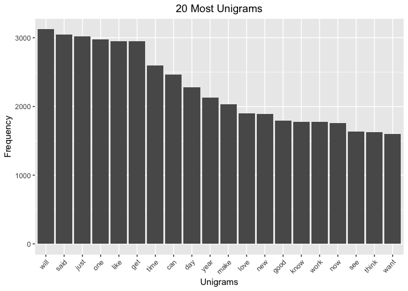

## Executive Summary
This is the Milestone Report for the Coursera Data Science Capstone project. The goal of the capstone project is to create a predictive text model using a large text corpus of documents as training data. Natural language processing techniques will be used to perform the analysis and build the predictive model.

This Milestone Report describes the major features of the data with my exploratory data analysis and summarizes. To get started with the Milestone Report I’ve download the Coursera Swiftkey Dataset. Also I've defind my plans for creating the predictive model(s) and a Shiny App as data product.

All the code is attached as Appendix.

**Files used:**

```
## [1] "en_US.blogs.txt"   "en_US.news.txt"    "en_US.twitter.txt"
```

## File details and stats
Let's have a look at the files. I determined the number of lines, number of characters, and number of words for each of the 3 datasets (Blog, News and Twitter). Also I calculate some basic stats on the number of words per line (WPL).
<table class="table table-striped table-hover" style="margin-left: auto; margin-right: auto;">
 <thead>
  <tr>
   <th style="text-align:left;"> File </th>
   <th style="text-align:right;"> Lines </th>
   <th style="text-align:right;"> LinesNEmpty </th>
   <th style="text-align:right;"> Chars </th>
   <th style="text-align:right;"> CharsNWhite </th>
   <th style="text-align:right;"> TotalWords </th>
   <th style="text-align:right;"> WPL_Min </th>
   <th style="text-align:right;"> WPL_Mean </th>
   <th style="text-align:right;"> WPL_Max </th>
  </tr>
 </thead>
<tbody>
  <tr>
   <td style="text-align:left;"> blogs </td>
   <td style="text-align:right;"> 899288 </td>
   <td style="text-align:right;"> 899288 </td>
   <td style="text-align:right;"> 206824382 </td>
   <td style="text-align:right;"> 170389539 </td>
   <td style="text-align:right;"> 37570839 </td>
   <td style="text-align:right;"> 0 </td>
   <td style="text-align:right;"> 41.75107 </td>
   <td style="text-align:right;"> 6726 </td>
  </tr>
  <tr>
   <td style="text-align:left;"> news </td>
   <td style="text-align:right;"> 1010242 </td>
   <td style="text-align:right;"> 1010242 </td>
   <td style="text-align:right;"> 203223154 </td>
   <td style="text-align:right;"> 169860866 </td>
   <td style="text-align:right;"> 34494539 </td>
   <td style="text-align:right;"> 1 </td>
   <td style="text-align:right;"> 34.40997 </td>
   <td style="text-align:right;"> 1796 </td>
  </tr>
  <tr>
   <td style="text-align:left;"> twitter </td>
   <td style="text-align:right;"> 2360148 </td>
   <td style="text-align:right;"> 2360148 </td>
   <td style="text-align:right;"> 162096241 </td>
   <td style="text-align:right;"> 134082806 </td>
   <td style="text-align:right;"> 30451170 </td>
   <td style="text-align:right;"> 1 </td>
   <td style="text-align:right;"> 12.75065 </td>
   <td style="text-align:right;"> 47 </td>
  </tr>
</tbody>
</table>

## Sample the data
The data files are very hugh, I will get a sample of 1% of every file and save it to RDS file `sample.rds` for saving space. We can load it in for starting the analysis.


## Preprocessing the data
After loading the sample RDS file, I created a Corpus and start to analyse the data with the `tm` library. 

There is a lot of information in the data I do not need and is not usefull. I need to clean it up and removed all numbers, convert text to lowercase, remove punctuation and stopwords, in this case english. After that. had I performed stemming, a stem is a form to which affixes can be attached. An example of this is wait, waits, waited, waiting, all of them are common to wait. When the stemming is done, I had removed a lot of characters which resulted in a lot of whitespaces, I removed this also.


## N-gram Tokenization
In the fields of computational linguistics and probability, an n-gram is a contiguous sequence of n items from a given sample of text or speech. The items can be phonemes, syllables, letters, words or base pairs according to the application. The n-grams typically are collected from a text or speech corpus. When the items are words, n-grams may also be called shingles.

An n-gram of size 1 is referred to as a "unigram", size 2 is a "bigram" and size 3 is a "trigram". 

The RWeka package has been used to develop the N-gram Tokenizersin order to create the unigram, bigram and trigram. 


## Exploratory Analysis
Know I'm ready to perform exploratory analysis on the data. It will be helpful to find the most frequenzies of occurring words based on on unigram, bigram and trigrams.  


### Unigrams
<table class="table table-striped table-hover" style="margin-left: auto; margin-right: auto;">
 <thead>
  <tr>
   <th style="text-align:left;">   </th>
   <th style="text-align:left;"> term </th>
   <th style="text-align:right;"> freq </th>
  </tr>
 </thead>
<tbody>
  <tr>
   <td style="text-align:left;"> will </td>
   <td style="text-align:left;"> will </td>
   <td style="text-align:right;"> 3124 </td>
  </tr>
  <tr>
   <td style="text-align:left;"> said </td>
   <td style="text-align:left;"> said </td>
   <td style="text-align:right;"> 3048 </td>
  </tr>
  <tr>
   <td style="text-align:left;"> just </td>
   <td style="text-align:left;"> just </td>
   <td style="text-align:right;"> 3019 </td>
  </tr>
  <tr>
   <td style="text-align:left;"> one </td>
   <td style="text-align:left;"> one </td>
   <td style="text-align:right;"> 2974 </td>
  </tr>
  <tr>
   <td style="text-align:left;"> like </td>
   <td style="text-align:left;"> like </td>
   <td style="text-align:right;"> 2953 </td>
  </tr>
  <tr>
   <td style="text-align:left;"> get </td>
   <td style="text-align:left;"> get </td>
   <td style="text-align:right;"> 2949 </td>
  </tr>
  <tr>
   <td style="text-align:left;"> time </td>
   <td style="text-align:left;"> time </td>
   <td style="text-align:right;"> 2598 </td>
  </tr>
  <tr>
   <td style="text-align:left;"> can </td>
   <td style="text-align:left;"> can </td>
   <td style="text-align:right;"> 2465 </td>
  </tr>
  <tr>
   <td style="text-align:left;"> day </td>
   <td style="text-align:left;"> day </td>
   <td style="text-align:right;"> 2277 </td>
  </tr>
  <tr>
   <td style="text-align:left;"> year </td>
   <td style="text-align:left;"> year </td>
   <td style="text-align:right;"> 2127 </td>
  </tr>
</tbody>
</table>

<!-- -->

### Bigrams
<table class="table table-striped table-hover" style="margin-left: auto; margin-right: auto;">
 <thead>
  <tr>
   <th style="text-align:left;">   </th>
   <th style="text-align:left;"> term </th>
   <th style="text-align:right;"> freq </th>
  </tr>
 </thead>
<tbody>
  <tr>
   <td style="text-align:left;"> right now </td>
   <td style="text-align:left;"> right now </td>
   <td style="text-align:right;"> 270 </td>
  </tr>
  <tr>
   <td style="text-align:left;"> last year </td>
   <td style="text-align:left;"> last year </td>
   <td style="text-align:right;"> 220 </td>
  </tr>
  <tr>
   <td style="text-align:left;"> look like </td>
   <td style="text-align:left;"> look like </td>
   <td style="text-align:right;"> 217 </td>
  </tr>
  <tr>
   <td style="text-align:left;"> cant wait </td>
   <td style="text-align:left;"> cant wait </td>
   <td style="text-align:right;"> 193 </td>
  </tr>
  <tr>
   <td style="text-align:left;"> new york </td>
   <td style="text-align:left;"> new york </td>
   <td style="text-align:right;"> 186 </td>
  </tr>
  <tr>
   <td style="text-align:left;"> last night </td>
   <td style="text-align:left;"> last night </td>
   <td style="text-align:right;"> 167 </td>
  </tr>
  <tr>
   <td style="text-align:left;"> year ago </td>
   <td style="text-align:left;"> year ago </td>
   <td style="text-align:right;"> 162 </td>
  </tr>
  <tr>
   <td style="text-align:left;"> look forward </td>
   <td style="text-align:left;"> look forward </td>
   <td style="text-align:right;"> 154 </td>
  </tr>
  <tr>
   <td style="text-align:left;"> feel like </td>
   <td style="text-align:left;"> feel like </td>
   <td style="text-align:right;"> 150 </td>
  </tr>
  <tr>
   <td style="text-align:left;"> high school </td>
   <td style="text-align:left;"> high school </td>
   <td style="text-align:right;"> 150 </td>
  </tr>
</tbody>
</table>

<!-- -->

### Trigrams
<table class="table table-striped table-hover" style="margin-left: auto; margin-right: auto;">
 <thead>
  <tr>
   <th style="text-align:left;">   </th>
   <th style="text-align:left;"> term </th>
   <th style="text-align:right;"> freq </th>
  </tr>
 </thead>
<tbody>
  <tr>
   <td style="text-align:left;"> happi mother day </td>
   <td style="text-align:left;"> happi mother day </td>
   <td style="text-align:right;"> 46 </td>
  </tr>
  <tr>
   <td style="text-align:left;"> cant wait see </td>
   <td style="text-align:left;"> cant wait see </td>
   <td style="text-align:right;"> 43 </td>
  </tr>
  <tr>
   <td style="text-align:left;"> new york citi </td>
   <td style="text-align:left;"> new york citi </td>
   <td style="text-align:right;"> 30 </td>
  </tr>
  <tr>
   <td style="text-align:left;"> happi new year </td>
   <td style="text-align:left;"> happi new year </td>
   <td style="text-align:right;"> 28 </td>
  </tr>
  <tr>
   <td style="text-align:left;"> let us know </td>
   <td style="text-align:left;"> let us know </td>
   <td style="text-align:right;"> 21 </td>
  </tr>
  <tr>
   <td style="text-align:left;"> look forward see </td>
   <td style="text-align:left;"> look forward see </td>
   <td style="text-align:right;"> 20 </td>
  </tr>
  <tr>
   <td style="text-align:left;"> cinco de mayo </td>
   <td style="text-align:left;"> cinco de mayo </td>
   <td style="text-align:right;"> 17 </td>
  </tr>
  <tr>
   <td style="text-align:left;"> two year ago </td>
   <td style="text-align:left;"> two year ago </td>
   <td style="text-align:right;"> 17 </td>
  </tr>
  <tr>
   <td style="text-align:left;"> new york time </td>
   <td style="text-align:left;"> new york time </td>
   <td style="text-align:right;"> 16 </td>
  </tr>
  <tr>
   <td style="text-align:left;"> im pretti sure </td>
   <td style="text-align:left;"> im pretti sure </td>
   <td style="text-align:right;"> 14 </td>
  </tr>
</tbody>
</table>

<!-- -->

## Development Plan
The next steps of this capstone project would be to create predictive models(s) based on the N-gram Tokenization, and deploy it as a data product. Here are my steps:

- Establish the predictive model(s) by using N-gram Tokenizations.
- Optimize the code for faster processing.
- Develop data product, a Shiny App, to make a next word prediction based on user inputs.
- Create a Slide Deck for pitching my algorithm and Shiny App. 

## Appendix
### Appendix - Load libraries, doParallel and files

```r
# Loading Libraries
library(doParallel)
library(tm)
library(stringi)
library(RWeka)
library(dplyr)
library(kableExtra)
library(SnowballC)
library(ggplot2)

# Setting up doParallel 
library(doParallel) 
set.seed(613)
n_cores <- detectCores() - 2  
registerDoParallel(n_cores,cores=n_cores)

# Show files used
directory_us <- file.path(".", "data", "final", "en_US/")
dir(directory_us)
```
### Appendix A - File details and stats

```r
#Loading Files and show summaries
blogs_con <- file(paste0(directory_us, "/en_US.blogs.txt"), "r")
blogs <- readLines(blogs_con, encoding="UTF-8", skipNul = TRUE)
close(blogs_con)

news_con <- file(paste0(directory_us, "/en_US.news.txt"), "r")
news <- readLines(news_con, encoding="UTF-8", skipNul = TRUE)
close(news_con)

twitter_con <- file(paste0(directory_us, "/en_US.twitter.txt"), "r")
twitter <- readLines(twitter_con, encoding="UTF-8", skipNul = TRUE)
close(twitter_con)

# Create stats of files
WPL <- sapply(list(blogs,news,twitter),function(x)
      summary(stri_count_words(x))[c('Min.','Mean','Max.')])
rownames(WPL) <- c('WPL_Min','WPL_Mean','WPL_Max')
rawstats <- data.frame(
  File = c("blogs","news","twitter"), 
  t(rbind(sapply(list(blogs,news,twitter),stri_stats_general),
          TotalWords = sapply(list(blogs,news,twitter),stri_stats_latex)[4,],
    WPL))
)
# Show stats in table
kable(rawstats) %>%
  kable_styling(bootstrap_options = c("striped", "hover"))
```
### Appendix B - Sample the data

```r
# Sample of data
set.seed(613)
data.sample <- c(sample(blogs, length(blogs) * 0.01),
                 sample(news, length(news) * 0.01),
                 sample(twitter, length(twitter) * 0.01))
saveRDS(data.sample, 'sample.rds')

# Ceaning up a other object we do not use anymore.
rm(blogs, blogs_con, data.sample, directory_us, news, news_con, rawstats, twitter, 
   twitter_con, WPL)
```
### Appendix C - Preprocessing the data

```r
# Load the RDS file
data <- readRDS("sample.rds")
# Create a Corpus
docs <- VCorpus(VectorSource(data))
# Remove data we do not need 
docs <- tm_map(docs, tolower)
docs <- tm_map(docs, removePunctuation)
docs <- tm_map(docs, removeNumbers)
docs <- tm_map(docs, removeWords, stopwords("english"))
# Do stamming
docs <- tm_map(docs, stemDocument)
# Strip whitespaces
docs <- tm_map(docs, stripWhitespace)
```
### Appendix D - N-gram Tokenization

```r
# Create Tokenization funtions
unigram <- function(x) NGramTokenizer(x, Weka_control(min = 1, max = 1))
bigram <- function(x) NGramTokenizer(x, Weka_control(min = 2, max = 2))
trigram <- function(x) NGramTokenizer(x, Weka_control(min = 3, max = 3))

# Create plain text format
docs <- tm_map(docs, PlainTextDocument)
```
### Appendix E - Exploratory Analysis

```r
# Create TermDocumentMatrix with Tokenizations and Remove Sparse Terms
tdm_freq1 <- removeSparseTerms(TermDocumentMatrix(docs, control = list(tokenize = unigram)), 0.9999)
tdm_freq2 <- removeSparseTerms(TermDocumentMatrix(docs, control = list(tokenize = bigram)), 0.9999)
tdm_freq3 <- removeSparseTerms(TermDocumentMatrix(docs, control = list(tokenize = trigram)), 0.9999)

# Create frequencies 
uni_freq <- sort(rowSums(as.matrix(tdm_freq1)), decreasing=TRUE)
bi_freq <- sort(rowSums(as.matrix(tdm_freq2)), decreasing=TRUE)
tri_freq <- sort(rowSums(as.matrix(tdm_freq3)), decreasing=TRUE)

# Create DataFrames
uni_df <- data.frame(term=names(uni_freq), freq=uni_freq)   
bi_df <- data.frame(term=names(bi_freq), freq=bi_freq)   
tri_df <- data.frame(term=names(tri_freq), freq=tri_freq)

# Show head 10 of unigrams
kable(head(uni_df,10))%>%
  kable_styling(bootstrap_options = c("striped", "hover"))
# Plot head 20 of unigrams
head(uni_df,20) %>% 
  ggplot(aes(reorder(term,-freq), freq)) +
  geom_bar(stat = "identity") +
  ggtitle("20 Most Unigrams") +
  xlab("Unigrams") + ylab("Frequency") +
  theme(plot.title = element_text(hjust = 0.5),
        axis.text.x = element_text(angle = 45, hjust = 1))

# Show head 10 of bigrams
kable(head(bi_df,10))%>%
  kable_styling(bootstrap_options = c("striped", "hover"))
# Plot head 20 of bigrams
head(bi_df,20) %>% 
  ggplot(aes(reorder(term,-freq), freq)) +
  geom_bar(stat = "identity") +
  ggtitle("20 Most Bigrams") +
  xlab("Bigrams") + ylab("Frequency") +
  theme(plot.title = element_text(hjust = 0.5),
        axis.text.x = element_text(angle = 45, hjust = 1))

# Show head 10 of trigrams
kable(head(tri_df,10))%>%
  kable_styling(bootstrap_options = c("striped", "hover"))
# Plot head 20 of trigrams
head(tri_df,20) %>% 
  ggplot(aes(reorder(term,-freq), freq)) +
  geom_bar(stat = "identity") +
  ggtitle("20 Most Trigrams") +
  xlab("Trigrams") + ylab("Frequency") +
  theme(plot.title = element_text(hjust = 0.5),
        axis.text.x = element_text(angle = 45, hjust = 1))
```
