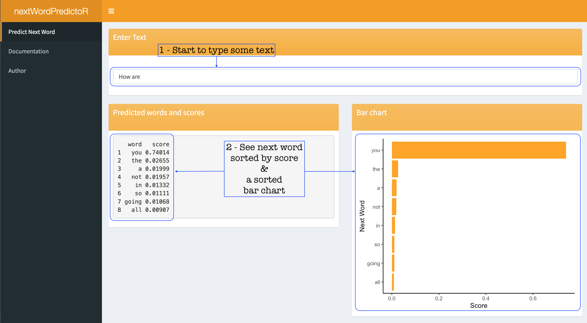
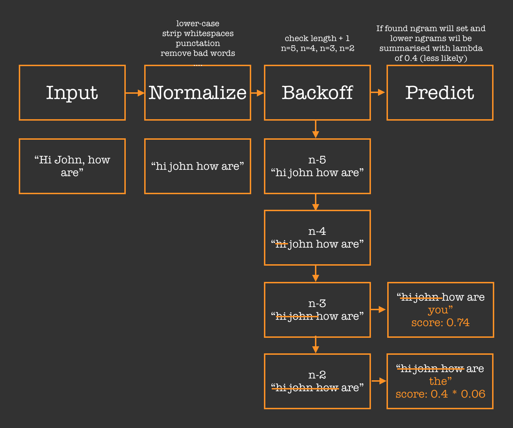

Next Word Prediction Application
========================================================
author: John Letteboer
date: May 17 2019
width: 1680
height: 1050
autosize: true
transition: rotate

Introduction
========================================================
Final application submission for the Johns Hopkins Coursera Data Science Capstone

- Next Word Prediction Application is created using Swiftkey datasets of twitter, news, and blog natural language text
- This application uses the N-gram model of natural language processing of a sentence and will try to "guess" the next word
- The prediction model is based on the Pentagram Stupid Backoff model 
- There are limitations, I was only able to use 10% of the data
- Shows the top 8 possibilities

How to use the application
========================================================
The application is straightfoward, the user only need to input a string of text and the application will try to predict the next word.

The Stupid Backoff model
========================================================
- N-gram model with "Stupid Backoff" ([Brants et al 2007](https://www.aclweb.org/anthology/D07-1090.pdf))
- Checks if highest-order (this case n=5) N-gram has been seen. If not it will degrades to a lower model (n=4, n=3 and n=2)

References
========================================================
- [JHU DS Capstone Swiftkey Dataset](https://d396qusza40orc.cloudfront.net/dsscapstone/dataset/Coursera-SwiftKey.zip)
- [List of Dirty, Naughty, Obscene, and Otherwise Bad Words](https://github.com/LDNOOBW/List-of-Dirty-Naughty-Obscene-and-Otherwise-Bad-Words)
- [Large Language Models in Machine Translation](https://www.aclweb.org/anthology/D07-1090.pdf)
- [Language Modeling](https://web.stanford.edu/class/cs124/lec/languagemodeling.pdf)

- [Try the Next Word Prediction Application](https://jletteboer.shinyapps.io/predictNextWord/)

